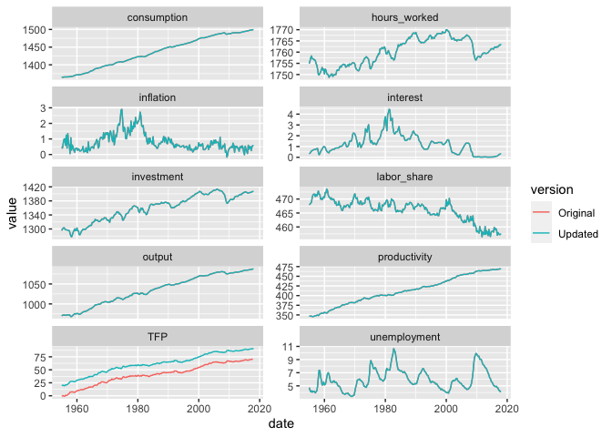

<!-- README.md is generated from README.Rmd. Please edit that file -->

# bcadata

<!-- badges: start -->

[](https://github.com/vfci/vfci/actions/workflows/R-CMD-check.yaml)
<!-- badges: end -->

The goal of bcadata is to replicate and update the data used by
Angeletos, Collard, and Dellas in their paper “Business Cycle Anatomy”
(2020) in the American Economic Review.

The package pulls most of the data from
[FRED](https://fred.stlouisfed.org) and TFP data from the [San Francisco
Fed](https://www.frbsf.org/economic-research/indicators-data/total-factor-productivity-tfp/).

The data series constructed are:

- output, Real GDP per capita
- investment, Real investment per capita
- consumption, Real consumption per capita
- hours_worked, Hours Worked
- unemployment, Unemployment Rate (as percent)
- labor_share, Labor share of output
- interest, Fed Funds interest rate (quarterly rate, not annual)
- inflation, Inflation rate, from GDP price deflator
- productivity, Productivity (NFB)
- TFP, Total Factor Productivity cummulative

## Installation

You can install the development version of bcadata from
[GitHub](https://github.com/) with:

``` r
# install.packages("devtools")
devtools::install_github("VFCI/bcadata")
```

## FRED API Key

This package requires a FRED API key to pull data from the St. Louis
Fed.

You can get an API key
[here](https://fred.stlouisfed.org/docs/api/api_key.html).

## Usage

``` r
  library(bcadata)
```

There are two functions exported from the package:

``` r
## Construct the updated data series
df <- pull_bcadata(fred_api_key = "XXXXXXXXXXXX")

## Chart comparing the updated series to the original data
compare_bcadata(df)
```

The package includes the original dataset from the [author’s replication
files](https://www.openicpsr.org/openicpsr/project/118082/version/V1/view).

``` r
original_bcadata
```

## Vintage data

There is also an option to use vintage data for the data pulled from
FRED. This makes use of [ALFRED](https://alfred.stlouisfed.org), the
archival version of FRED.

To pull data using a specific vintage date:

``` r
df <- pull_bcadata(fred_api_key = "XXXXXXXXXXXX", vintage_date = "2020-01-01")
```

## Replication of Original BCA data

With specific validation dates, this package can replicate the data used
in the BCA paper.

Data for TFP is pulled from [John G. Fernald’s
website](https://www.johnfernald.net/TFP) where he stores archived
versions of the TFP data hosted at the San Francisco Fed. To replicate
the original paper, the package pulls the file
`data_quarterly_2018.05.03.xlsx`.

For the other macro time series, all are pulled using ALFRED, using the
validation date of `"2018-07-26"`, except for the series for real GDP,
which is pulled using the validation date `"2018-07-28"`.

This is accomplished by setting the paramter `replicate` to `TRUE`.

``` r

replication <- pull_bcadata("XXXXXXXXXXXX", replicate = TRUE)
#> Warning: There was 1 warning in `mutate()`.
#> ℹ In argument: `name = as.numeric(.data$name)`.
#> Caused by warning:
#> ! NAs introduced by coercion

compare_bcadata(replication)
```


